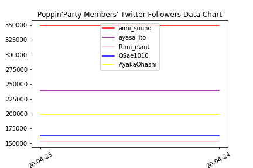

# 小偶像推特数据爬取与分析
听说某组迫真垄断统计数据，于是闲来无事写了这玩意。
这个示例是获取PPP的。如果需要获取别的小偶像的数据，请在/lib/dict.py中添加相应的信息，并修改。

## 示例输出

```
Poppin'Party声优Twitter关注者数统计
百京时间20-04-23记录
爱美: 348941 (+78)
伊藤彩沙: 239729 (+51)
西本里美: 153553 (+37)
大冢纱英: 162621 (+50)
大桥彩香: 198321 (+24)
*无需授权，随意转载
*技术支持：申必壬
```




## Release Note

- 0.1.1
    - 申必壬2号做了一些微小的贡献。包括修改语病，调整代码结构，完善文档与注释。

- 0.1.0